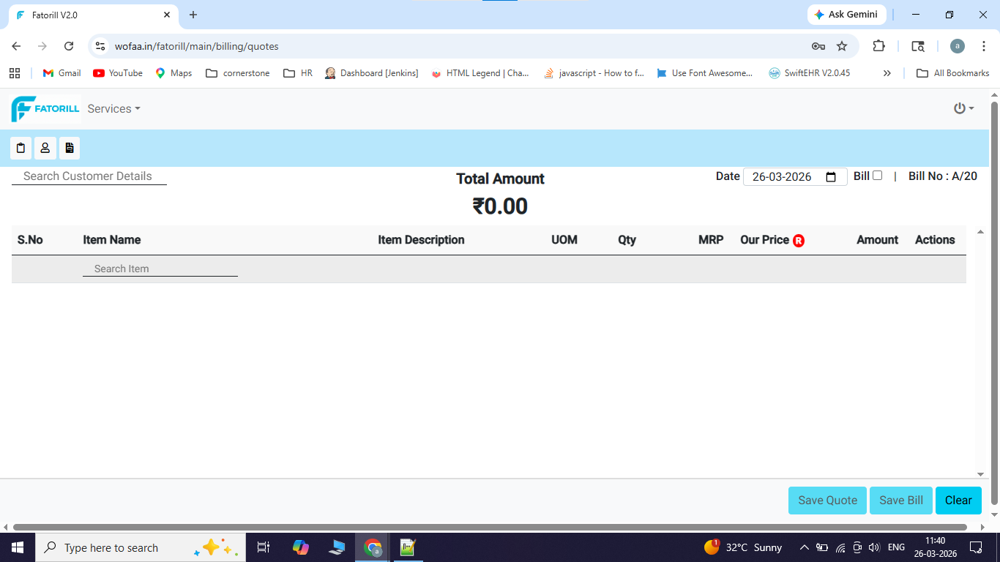
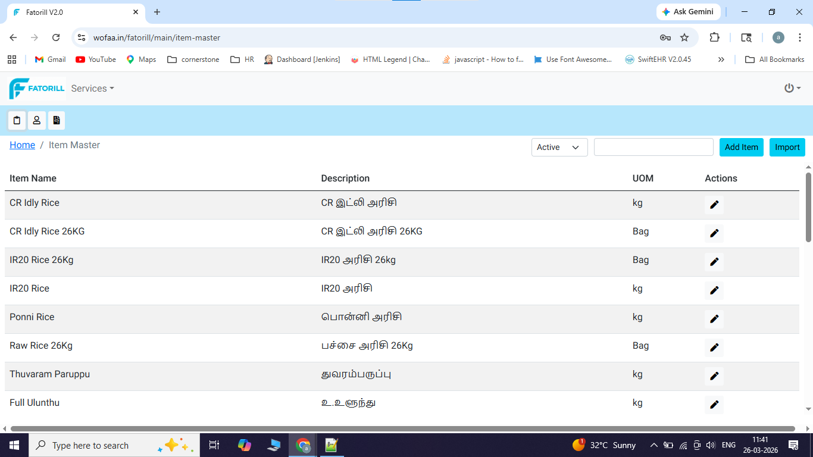
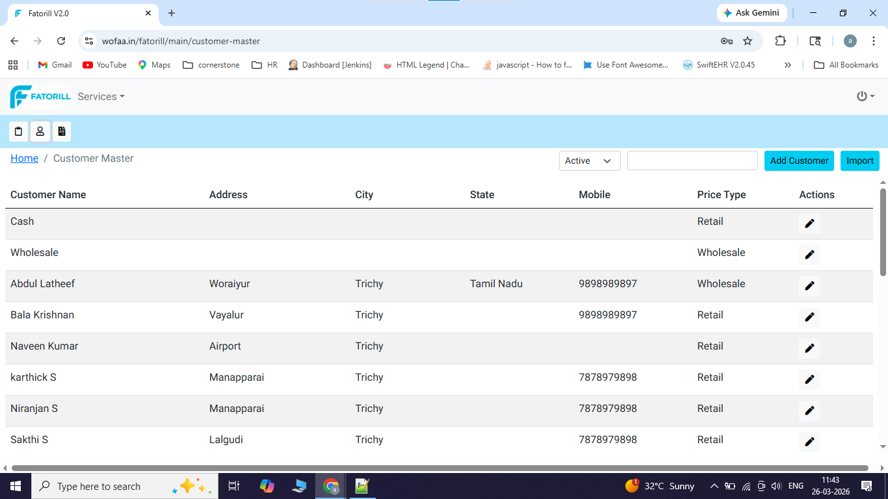
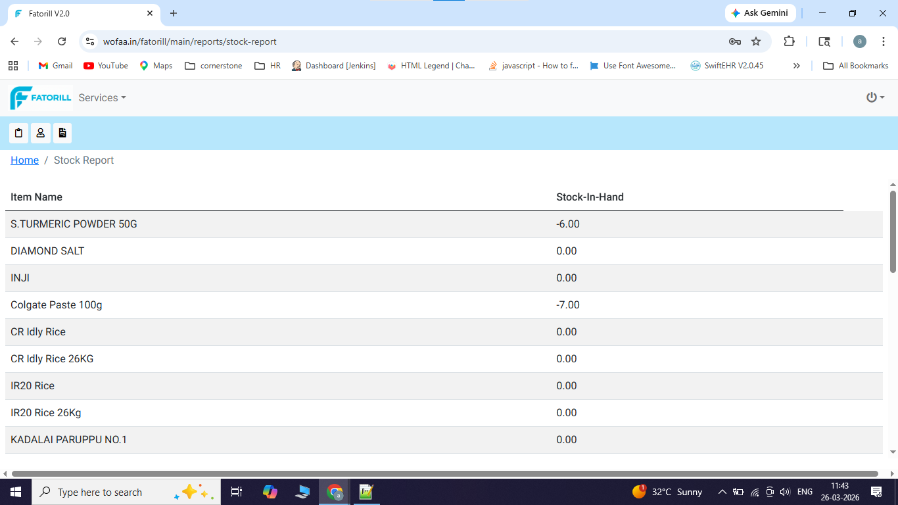
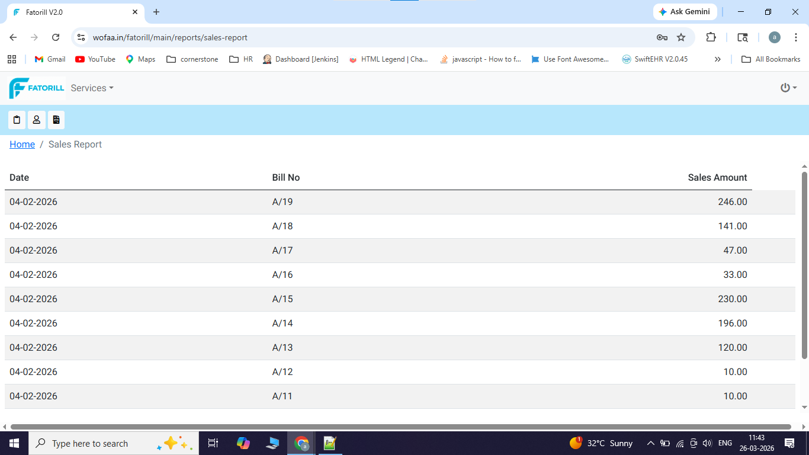
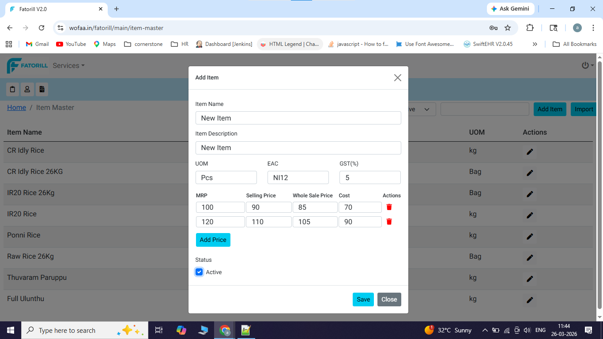
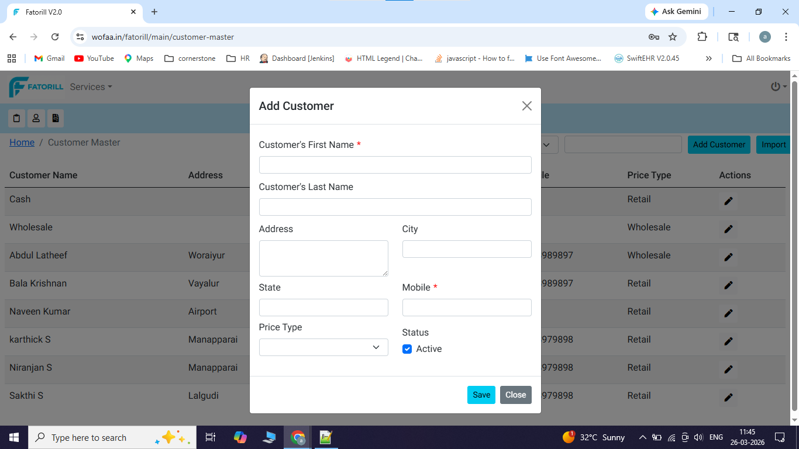

👋 Hi, I'm Mohamed Azarudeen 

💻 Full Stack Developer (Angular + Flask)

#Project
# 🧾 Fatorill Billing Application

A full-stack billing and inventory management system designed for small and medium businesses to manage sales, quotations, customers, and stock efficiently.

## 🚀 Features

### 🧾 Billing Management

* Create and manage invoices
* Auto calculation of totals, taxes, and discounts
* Printable bill format

### 📄 Quotation Module

* Generate quotations for customers
* Convert quotations into invoices
* Track quotation history

### 📦 Item Master

* Add, update, and manage products
* Maintain item pricing, Simple and Multiple Price 

### 👥 Customer Master

* Store customer details

### 📊 Reports & Analytics

* 📈 Sales Report (daily/monthly)
* 📦 Stock Report (available inventory)
* Sample reports for business insights

## 🛠️ Tech Stack

* Frontend: Angular
* Backend: Python (Flask)
* Database: MySQL

## 🎯 Key Highlights

* Full CRUD operations across modules
* Structured backend APIs
* Modular frontend architecture
* Real-world business use case
* JWT - Integrated for Authentication

## 📸 Screenshots

## 📌 Fatorill – Billing & Inventory System [Project's In GIT]

- 🔗 Backend API: [fatorill-billing-api](#)
- 🎨 Frontend UI: [fatorill-billing-ui](#)
## 🌟 Future Enhancements

* GST integration
* Role-based access (Admin/User)
* Export reports (PDF/Excel)

📫 App Link for Live Test:(Deployed in cPanel Shared Server): https://www.wofaa.in/fatorill

Test User : admin
Password : Admin@123

📫 Contact:
- [LinkedIn](https://www.linkedin.com/in/mdazarudeen17/)
- Email : azare201@gmail.com
